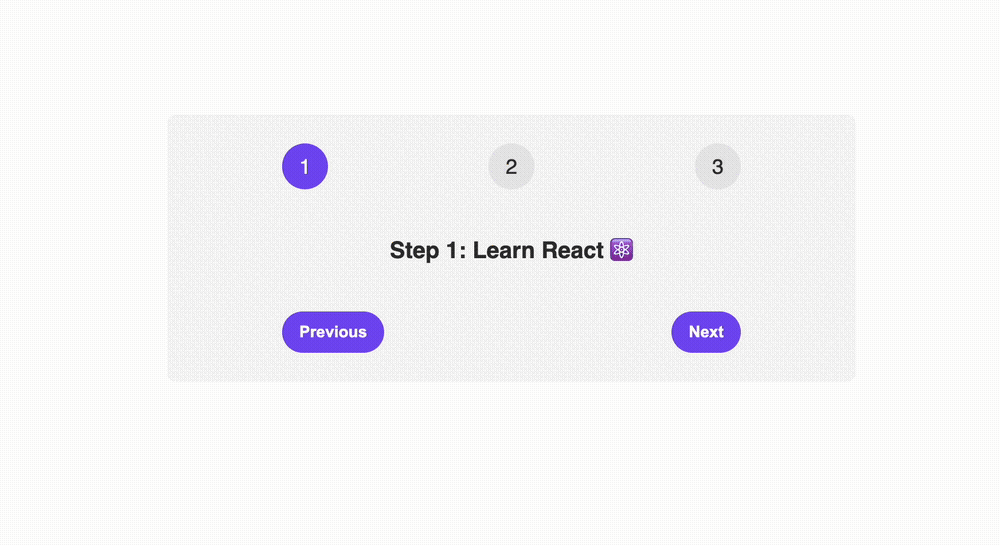

# React TypeScript Learning Projects

This repository contains several pet-projects built to learn and practice React with TypeScript ordered from top to bottom. Each project focuses on different aspects of React development. Below is a brief description of each project:

## Splitwise App

The Splitwise App is designed to help users split bills with friends. This application showcases advanced usage of React's useState and demonstrates form handling in a dynamic and interactive manner.

#### Features

- Bill Splitting Form: Allows users to input bill details and split the expense with selected friends.
- Add Friend Form: Users can add friends to split the bill with.
- Dynamic Form Handling: Forms are created and managed dynamically using React components.

## Packing List App

A todo-like app designed for creating packing lists for upcoming travels. Features include:

- Usage of children and forwarding state
- UI for adding items to the packing list

## FAQ Accordion Component

- Management of form state using useState
- Component Composition

## Steps Component

A component designed to manage forms with multiple steps. Features include:

- Management of form state using useState

## Pizza Menu

A static application to learn the basics of component creation. Features include:

- Creation of static components
